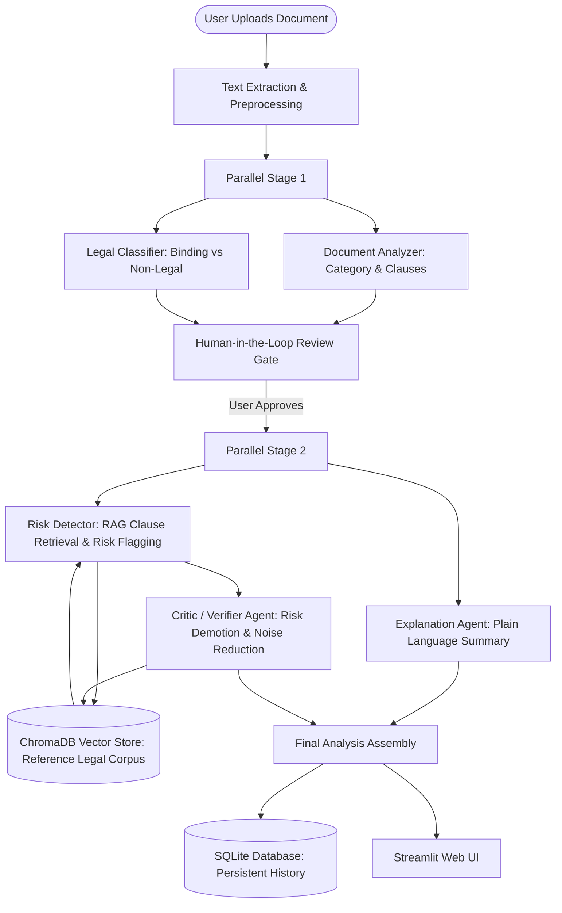

# LegalValidate AI — Complete System Explanation & Architecture Guide

> **Document Purpose**: This document provides a comprehensive explanation of LegalValidate AI, detailing the underlying vision, technical architecture, component workflows, technology stack, failure modes, and troubleshooting procedures.

---

## 1. The Vision Behind LegalValidate AI

### The Problem with Vanilla LLM Legal Analysis
Standard generative AI tools (such as ungrounded Chatbots or basic single-prompt LLM wrappers) struggle with legal document validation for several critical reasons:
1. **Boilerplate False Positives**: Standard LLMs frequently flag harmless, standard legal boilerplate (e.g., standard governing law or confidentiality definition clauses) as high-risk red flags, causing excessive noise and user fatigue.
2. **Hallucination & Lack of Grounding**: LLMs rely purely on parametric memory, making subjective judgments on what is "unfair" without comparing clauses against established commercial benchmarks.
3. **Adversarial Vulnerabilities**: Vanilla prompts are easily tricked by non-binding academic hypotheticals (e.g., law school exam case studies), sci-fi treaties (e.g., fictional space accords), or prompt injections disguised as terms of service.
4. **Lack of Human Oversight & Auditability**: Autonomous AI outputs can be risky in legal contexts; without structured pause gates or verification steps, errors can be accepted without human review.

### The Actual Vision
**LegalValidate AI** was built to solve these exact challenges by transforming contract review into a **multi-agent, RAG-grounded, human-in-the-loop audit pipeline**. The core goals of the system are:
* **100% Classification Precision**: Accurately distinguishing true operative legal agreements from non-operative utility documents, academic exercises, and fictional text.
* **Grounding Against Legal Standards**: Evaluating potential contract risks by retrieving actual standard reference clauses from a vector database (RAG) rather than relying on LLM speculation.
* **Dual-Layer Verification (Critic Agent)**: Employing a dedicated Critic agent to filter out weak or generic risk flags, ensuring only high-severity, genuine contractual risks are reported.
* **Human-in-the-Loop Control**: Pausing execution via LangGraph state checkpoints so human reviewers can verify initial document classification before full risk extraction proceeds.

---

## 2. System Architecture & How It Works

LegalValidate AI is built using a **Directed Acyclic Graph (DAG) stateful workflow** powered by **LangGraph**. The workflow executes across multi-agent fan-out and fan-in stages:



### Detailed Agent Breakdown

| Agent Name | Primary Responsibility | Model Powered (`config.py`) | Tech / Method Used |
| :--- | :--- | :--- | :--- |
| **`document_analyzer`** | Identifies specific document category (e.g., NDA, Lease, Employment Agreement) and extracts key sections. | `qwen/qwen3.8-27b` | Pydantic Schema Tool Calling + Structured Parsing |
| **`legal_classifier`** | Classifies document as `Legal` (binding) or `Non-Legal` (academic/fictional/utility). | `openai/gpt-oss-20b` | Few-Shot Prompting + Rule Enforcement |
| **`risk_detector`** | Flags potential risks, indemnities, and unfair covenants by comparing text to reference standards. | `qwen/qwen3.8-27b` | RAG Retrieval via ChromaDB Vector Search |
| **`critic`** | Reviews flagged risks and demotes/removes boilerplate or generic noise. | `qwen/qwen3.8-27b` | Grounded Verification & Severity Downgrade Rules |
| **`explanation_agent`** | Translates complex legalese into clear, plain-language summaries for non-lawyers. | `openai/gpt-oss-20b` | Structured Summarization Prompt |
| **`comparator`** | Compares two contract versions (e.g., Original vs Revised) to highlight semantic changes and risks. | `qwen/qwen3.8-27b` | Semantic Difference Analysis |

---

## 3. Core Technologies Used

LegalValidate AI brings together a modern Python stack designed for speed, structure, and persistence:

1. **LangGraph (`graph.py`)**:
   - Manages state transitions, branch parallelization, state persistence, and human-in-the-loop interruption using `MemorySaver` / SQLite checkpointers.

2. **LangChain & Groq API (`agents.py`, `config.py`)**:
   - High-throughput LLM inference powered by Groq LPUs.
   - Pydantic structured output chains (`with_structured_output`) with automatic repair retries (`invoke_with_retry_and_repair`).

3. **ChromaDB Vector Store (`retriever.py`)**:
   - Vector database storing standard baseline contract clauses (NDAs, Leases, SLAs, Employment terms). Uses sentence embeddings (`all-MiniLM-L6-v2`) for cosine similarity retrieval.

4. **Streamlit (`app.py`)**:
   - Interactive multi-tab web dashboard for single-document analysis, dual-document side-by-side comparison, interactive risk approval, and past audit history browsing.

5. **SQLite Database (`db.py`)**:
   - Stores complete JSON records of completed document reviews in `legalvalidate.db` (`analyses` table) for zero-latency reloading without re-executing LLM graphs.

6. **Tesseract OCR & PDF Parsing (`utils.py`)**:
   - `pdf2image`, `pypdfium2`, `python-docx`, and `pytesseract` for extracting clean text from scanned image PDFs, digital PDFs, Word documents, and text files.

7. **Docker & Docker Compose (`Dockerfile`, `docker-compose.yml`)**:
   - Containerization recipe including Linux system packages (`tesseract-ocr`, `poppler-utils`) for turnkey execution across any platform.

---

## 4. Failure Mode Analysis: What Part Is Failing If the App Is Not Working?

If LegalValidate AI encounters issues or yields unexpected results, use the diagnostic matrix below to isolate and repair the failing component:

```
           +-------------------------------------------------------+
           |                App Not Working Properly              |
           +-------------------------------------------------------+
                                       |
     +-----------------+---------------+---------------+-----------------+
     |                 |               |               |                 |
[1. Groq / LLM]  [2. OCR / PDF]  [3. RAG / Vector] [4. LangGraph]  [5. Database / UI]
```

### Failure Mode 1: Groq API & LLM Tool Calling Errors
* **Symptoms**: Streamlit error `groq.RateLimitError (429)`, `401 Unauthorized`, or `BadRequestError: tool calling is not supported`.
* **Root Causes**:
  * Missing or invalid `GROQ_API_KEY` in `.env`.
  * Model ID specified in `config.py` or `.env` has been decommissioned or rate-limited by Groq.
* **Troubleshooting Steps**:
  1. Check terminal output for the exact Groq error code.
  2. Verify `.env` contains a valid key: `GROQ_API_KEY=gsk_...`.
  3. Test Groq connection and model availability by running:
     ```bash
     python -c "import os, dotenv, groq; dotenv.load_dotenv(); client = groq.Groq(api_key=os.getenv('GROQ_API_KEY')); print([m.id for m in client.models.list().data])"
     ```
  4. Ensure `config.py` uses active models (`qwen/qwen3.8-27b` and `openai/gpt-oss-20b`).

---

### Failure Mode 2: Document Ingestion & OCR Failures
* **Symptoms**: Document uploads fail, extracted text is blank/empty, or terminal displays `TesseractNotFoundError` / `PDFInfoNotInstalledError`.
* **Root Causes**:
  * Missing Tesseract OCR or Poppler system binaries on the host OS.
  * PDF file is corrupted, password-protected, or zero-byte.
* **Troubleshooting Steps**:
  1. Check `utils.py` function `extract_text_from_file`.
  2. If running natively on Windows/Linux, verify Tesseract and Poppler are in your OS `PATH`.
  3. Alternatively, launch the app via Docker, which pre-installs all system binaries automatically:
     ```bash
     docker compose up --build
     ```

---

### Failure Mode 3: RAG Retrieval & Chroma Vector Store Failures
* **Symptoms**: Risk Detector outputs 0 risks, throws `ChromaDB connection error`, or complains about embedding dimension mismatches.
* **Root Causes**:
  * Chroma DB directory (`data/chroma_db`) is corrupt or uninitialized.
  * `sentence-transformers` embedding model failed to download due to internet connectivity issues.
* **Troubleshooting Steps**:
  1. Verify `data/chroma_db` exists and has read/write permissions.
  2. Force re-seeding of the vector store by running:
     ```bash
     python retriever.py
     ```
  3. Ensure `ENABLE_RETRIEVAL=true` is set in `.env`.

---

### Failure Mode 4: LangGraph Execution Halts or Stalls
* **Symptoms**: The app progresses through initial analysis but stops at "Analysis Paused for Human Review" without completing risk detection.
* **Root Causes**:
  * LangGraph reaches the `human_review_node` interrupt gate by design, waiting for user approval.
  * SQLite thread checkpointer (`checkpoints.db`) is locked by another process.
* **Troubleshooting Steps**:
  1. This is **expected workflow behavior**. Click the **"Approve & Resume Analysis"** button in the Streamlit UI to resume execution.
  2. If the UI button fails to trigger resume, check `graph.py` thread configuration and clear stale checkpoint files (`rm checkpoints.db*`).

---

### Failure Mode 5: Database Persistence & History Tab Errors
* **Symptoms**: Past analyses do not appear in the "History" tab, or Streamlit throws `sqlite3.OperationalError: no such table: analyses`.
* **Root Causes**:
  * `legalvalidate.db` database was deleted or permissions were denied.
  * Schema mismatch between `db.py` and saved state objects.
* **Troubleshooting Steps**:
  1. Check `db.py` execution. `init_db()` is called automatically on app startup.
  2. Run `python -c "import db; db.init_db()"` to initialize or repair tables.

---

### Failure Mode 6: Classifier Prompt Drift (False Positives / False Negatives)
* **Symptoms**: Non-legal documents (e.g., law school exams or fictional treaties) are labeled as `Legal`, or real contracts are labeled as `Non-Legal`.
* **Root Causes**:
  * Modifications to `classify_legal` prompt in `agents.py` removed essential criteria or few-shot examples.
* **Troubleshooting Steps**:
  1. Run the automated evaluation suite against the 34-document benchmark test set:
     ```bash
     python evals/eval.py
     ```
  2. Verify classification accuracy remains at 100%.

---

## 5. Summary of System Assets & Files

| File Path | Description |
| :--- | :--- |
| **`app.py`** | Main Streamlit web application providing UI tabs, state handling, and history rendering. |
| **`graph.py`** | LangGraph DAG definition connecting agents, interrupt gates, and thread checkpoints. |
| **`agents.py`** | Multi-agent function implementations, Pydantic schemas, and LLM prompt templates. |
| **`retriever.py`** | ChromaDB vector store wrapper for seeding baseline clauses and retrieving grounded context. |
| **`config.py`** | Central per-agent model routing mapping (`MODEL_CONFIG`). |
| **`db.py`** | SQLite helper functions (`init_db`, `save_analysis`, `get_history`, `get_analysis_by_id`). |
| **`utils.py`** | Document text extraction helpers for PDF, DOCX, OCR, and section splitting. |
| **`evals/eval.py`** | Automated benchmark test suite evaluating classification accuracy and risk recall against 34 labeled documents. |
| **`Dockerfile` & `docker-compose.yml`** | Docker deployment configuration with system dependencies and volume mounts. |

---
*Created for LegalValidate AI documentation & architecture reference.*
