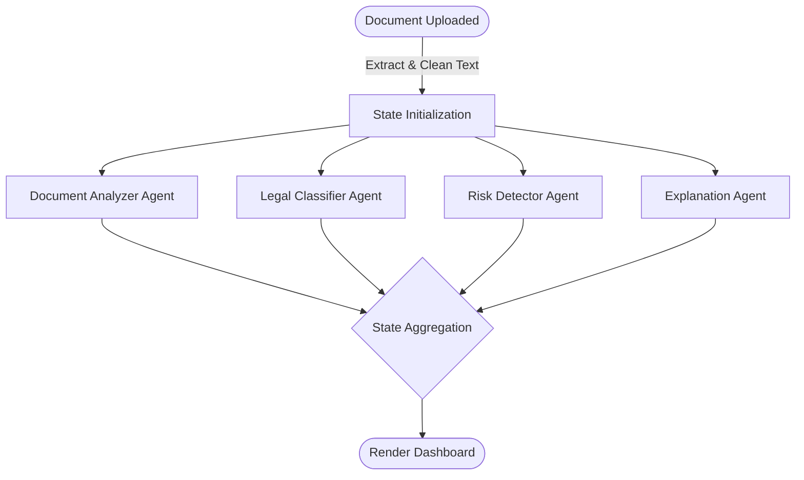

# Project Analysis: LegalValidate AI

**LegalValidate AI** is an AI-powered legal contract assistant designed to help non-legal experts easily review, classify, and understand legal documents. It automates risk detection, simplifies complex legalese, and extracts key clauses using a multi-agent system powered by **LangGraph**, **LangChain**, and **Groq LLMs**.

---

## 🏗️ Technical Architecture Stack

The project is built on the following technologies:
* **User Interface**: [app.py](file:///c:/Users/tanis/OneDrive/Desktop/ANTIGRAVITY/legalvalidate_ai/app.py) (Streamlit) — provides a responsive, web-based dashboard for document upload and analysis visualization.
* **Orchestration**: [graph.py](file:///c:/Users/tanis/OneDrive/Desktop/ANTIGRAVITY/legalvalidate_ai/graph.py) (LangGraph) — coordinates a multi-agent system running workflows in parallel.
* **LLM Integration**: [agents.py](file:///c:/Users/tanis/OneDrive/Desktop/ANTIGRAVITY/legalvalidate_ai/agents.py) (LangChain & `langchain-groq`) — manages prompts and handles structured LLM outputs using Pydantic schemas.
* **PDF Processing**: [utils.py](file:///c:/Users/tanis/OneDrive/Desktop/ANTIGRAVITY/legalvalidate_ai/utils.py) (`PyPDF2`) — extracts text from uploaded PDF documents.
* **Model Endpoint**: Groq API (defaulting to the `llama-3.1-8b-instant` model) — provides fast inference for the agent logic.

---

## 🤖 Multi-Agent Workflow

LegalValidate AI uses a **parallel multi-agent workflow** orchestrated via LangGraph in [graph.py](file:///c:/Users/tanis/OneDrive/Desktop/ANTIGRAVITY/legalvalidate_ai/graph.py). 

When a user uploads a document, the raw text is cleaned and broadcast to all four independent agents simultaneously. Their structured outputs are merged back into a single global state before rendering the dashboard.



---

## 📄 Core Components & Agents

Here is a breakdown of the agents defined in [agents.py](file:///c:/Users/tanis/OneDrive/Desktop/ANTIGRAVITY/legalvalidate_ai/agents.py) and their structured outputs:

| Agent Name | Description | Key Output Fields |
| :--- | :--- | :--- |
| **Document Analyzer** | Identifies the specific document type and extracts key structural metadata/sections. | `document_type` (e.g. Non-Disclosure Agreement), `key_clauses` (list of key clauses found) |
| **Legal Classifier** | Assesses whether the document is legally binding (agreements, contracts, policies) or non-legal (invoices, admit cards, schedules). | `is_legal` (bool), `classification` (Legal/Non-Legal), `reason` (one-line summary), `explanation` (if problematic) |
| **Risk Detector** | Audits the document for potential legal liabilities, ambiguous clauses, unfair conditions, or missing protections. | `risks` (list of detected issues/ambiguities) |
| **Explanation Agent** | Translates complex legal terminology into simple, layman's terms for non-experts. | `summary` (brief summary), `simplified_explanation` (plain-language details) |

> [!NOTE]
> All agents utilize **Structured Outputs** (`llm.with_structured_output`) coupled with **Pydantic models**. This guarantees that the LLM response is strictly parsed into JSON schemas and fits the internal `AgentState` without parsing errors.

---

## 📊 Dashboard UI Features

The main application in [app.py](file:///c:/Users/tanis/OneDrive/Desktop/ANTIGRAVITY/legalvalidate_ai/app.py) handles the frontend layout:
1. **Metrics Banner**: Instantly flags the document type, legal classification (approved legal vs. review needed), and the total number of detected risks.
2. **Risk Intelligence**: Highlights key warnings inside alert cards using custom CSS formatting.
3. **Simplified Review**: Displays the document summary and its plain-language translation side-by-side.
4. **Key Clauses Accordion**: Lists the identified sections/clauses and details classification rationale.
5. **Raw Intelligence Data**: Provides a JSON tree view of the raw state object for power users or debugging.

---

## ⚙️ How to Set Up & Run the Project

### 1. Configure the Environment
Ensure your environment variables are configured. Create a `.env` file in the root directory (based on `.env.example`):
```bash
GROQ_API_KEY=your_actual_groq_api_key
```

### 2. Install Dependencies
Install all required libraries from [requirements.txt](file:///c:/Users/tanis/OneDrive/Desktop/ANTIGRAVITY/legalvalidate_ai/requirements.txt):
```bash
pip install -r requirements.txt
```

### 3. Run the App
Launch the Streamlit dashboard:
```bash
streamlit run app.py
```
